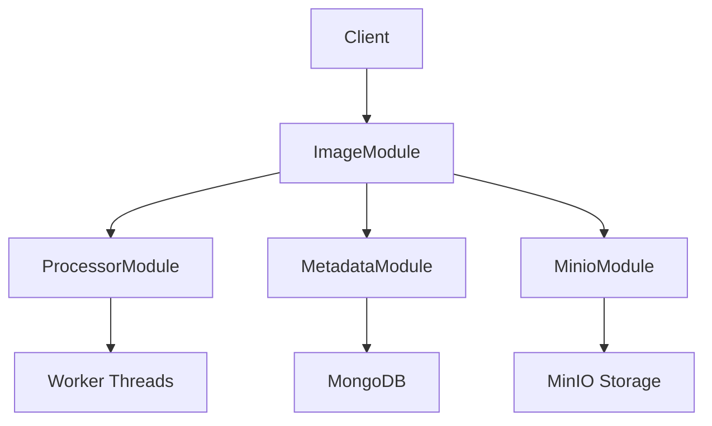

# image_server

이미지 호스팅 및 관리를 위한 이미지 서비스

## 주요 기능

- 이미지 업로드 및 최적화
- 중복 이미지 자동 감지 (`SHA-256` 해시 기반)
- 이미지 리사이징 및 WebP 변환
- 참조 카운트 기반 이미지 관리

## 기술 스택

- Backend : NestJS
- 데이터베이스 : MongoDB
- 파일 스토리지 : MinIO
- 이미지 처리 : Sharp
- 워커 스레드 기반 이미지 처리

## 시스템 구성

### 시스템 구조



**주요 모듈**

- [`ImageModule`](image-server/src/image/image.module.ts): 이미지 관련 핵심 기능
- [`ProcessorModule`](image-server/src/processor/processor.module.ts): 이미지 처리 워커 관리
- [`MetadataModule`](image-server/src/metadata/metadata.module.ts): MongoDB 기반 메타데이터 관리
- [`MinioModule`](image-server/src/minio/minio.module.ts): MinIO 기반 이미지 저장소 관리

### 모듈 구성

#### 1. ImageModule (오케스트레이션 계층)

전체 이미지 처리 흐름 관리

다른 모듈들과의 통신 조정

트랜잭션 및 에러 처리 담당

#### 2. ProcessorModule (이미지 처리 계층)

Worker Thread Pool 관리

이미지 최적화 및 변환

비동기 처리로 성능 향상

#### 3. MetadataModule (데이터 계층)

MongoDB 기반 메타데이터 관리

이미지 중복 검사

참조 카운팅 처리

#### 4. MinioModule (스토리지 계층)

실제 이미지 파일 저장 관리

확장 가능한 객체 스토리지 연동

## 설치 및 실행

### 환경 설정

1. `.env` 파일 생성(image-server 폴더)

`image-server` 폴더 내부에 `.env`를 생성합니다.

필요한 요소는 다음과 같습니다.

```bash
# Node
NODE_ENV=상태
PORT=포트번호

# MongoDB
MONGO_HOST=CHECK-DOCKER-COMPOSE-EXAMPLE
MONGO_PORT=CHECK-DOCKER-COMPOSE-EXAMPLE
MONGO_USER=CHECK-DOCKER-COMPOSE-EXAMPLE
MONGO_PASSWORD=CHECK-DOCKER-COMPOSE-EXAMPLE
MONGO_DATABASE=CHECK-DOCKER-COMPOSE-EXAMPLE

# MinIO
MINIO_ENDPOINT=CHECK-DOCKER-COMPOSE-EXAMPLE
MINIO_PORT=CHECK-DOCKER-COMPOSE-EXAMPLE
MINIO_ACCESS_KEY=CHECK-DOCKER-COMPOSE-EXAMPLE
MINIO_SECRET_KEY=CHECK-DOCKER-COMPOSE-EXAMPLE
MINIO_BUCKET_NAME=CHECK-DOCKER-COMPOSE-EXAMPLE

```

### 실행 방법

1. 의존성 설치

```bash
cd image-server
npm install
```

2. 개발 서버 실행

```bash
npm run start:dev
```

## 이미지 처리 프로세스

1. 이미지 업로드 요청 수신
2. `ProcessorService`가 워커 스레드로 이미지 처리 위임
3. 워커에서 이미지 최적화 (800 \* 600) 리사이즈, WebP 변환 (동적 리사이징 구현 예정...)
4. `SHA-256` 해시를 통한 중복값 확인
5. `MetadataService`로 메타데이터 저장/갱신
6. `MinioService` 이미지 저장

## 이미지 메타데이터 스키마

`ImageMetadata` 스키마는 다음 필드를 포함합니다.

- `hash_sha256`: 이미지 해시 (중복 확인용)
- `object_key`: MinIO 저장소의 객체 키
- `reference_count`: 참조 카운트
- `mime_type`: 이미지 MIME 타입
- `width`: 이미지 너비
- `height`: 이미지 높이
- `is_public`: 공개 여부
